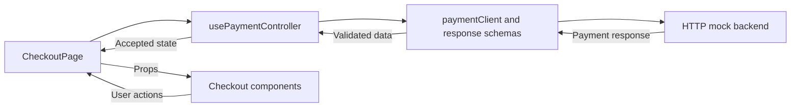
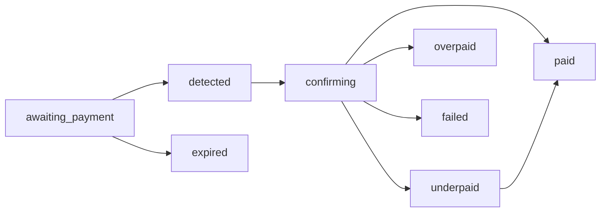

# Stablecoin Checkout: Design Doc

This document explains the current implementation. Use the [README](../README.md) to run it and the [API contract](API_CONTRACT.md) for request and response fields.

## What the application does

The shopper chooses a currency and network, receives one set of transfer instructions, and follows the payment result. Vue 3 renders the page; a Node HTTP mock in `backend/` supplies orders, quotes and status changes. No wallet or blockchain is connected.

Three terms describe the data:

- **Order:** what the shopper is paying for. Its ID stays the same when the payment method changes.
- **Payment:** one payment attempt, identified by `payment_reference`.
- **Quote:** that payment's currency, network, amount, address, fee, rate and expiry time.

The API owns merchant/order facts and supported currencies/networks. The first API currency and its first network are selected by default. The frontend does not maintain a separate list of supported pairs.

## From opening the page to payment

1. **Validate the link.** An explicit `order` or `sig` URL is checked before starting the payment controller. The bare demo URL uses the default registered order.
2. **Load the catalogue.** Fetch currency precision and network metadata. If a saved payment reference exists, restore it through GET. An unresolved creation marker blocks a new attempt instead.
3. **Load order information for a fresh checkout.** The API has no separate merchant/order endpoint, so the page sends an ordinary payment POST. It keeps only merchant and order information; it discards the response's reference, quote and deadline from frontend state. The unfunded backend record remains until replaced or reset.
4. **Let the shopper choose.** Currency and network changes update a draft. They do not create payments.
5. **Continue.** The first Continue always sends another creation POST and accepts its complete response. Only this payment supplies transfer instructions, a saved reference and polling.
6. **Follow the result.** Status GETs update the accepted payment. The frontend displays the backend's status instead of deriving paid, underpaid or overpaid from an amount alone.

A fresh session therefore normally makes **two creation POSTs**: one for display metadata and one for Continue. This is an API limitation, not a separate metadata-only creation mode. A production integration could remove the extra creation by providing a metadata endpoint; the current implementation does not have one.

## What Change and Continue reuse

| Action | Request and retained data | Visible result |
| --- | --- | --- |
| Change or edit the draft | Keep the existing payment and continue its eligible polling. No replacement POST. | Hide old transfer instructions and the footer reference while the selector is visible. |
| First Continue | Create a new payment, even if its pair matches the metadata request. | Show the accepted creation response. |
| Continue with the same accepted pair | GET the existing payment; retain its reference and original quote, including expiry. | Resume the same payment. Its reference can reappear while the GET is pending. |
| Continue with a different currency or network | POST a new payment. Replace the accepted payment only when a valid response arrives. | Hide the footer reference during creation; then show the new response's reference and details. |
| Get a new quote after expiry | GET to reconcile, then requote the expired, unfunded payment. | Keep its reference and accept a new quote. |
| Reload | Use the order's stored reference to GET current data. | Restore the payment after verification. |

A reference belongs to a payment attempt, not to a currency. In the mock, USDT → USDC → USDT creates three successive references when each change is submitted. Replacement removes the previous unfunded backend record.

The footer is empty before an accepted payment exists. Change hides its reference without deleting the internal payment or storage entry. If replacement fails, the old payment is retained and its reference can reappear with the error. Keeping that identity allows reconciliation of a request whose outcome may be unknown.

Some data is deliberately reused:

- The currency catalogue is loaded at initialization and reused for selection and response validation.
- Merchant/order information stays visible during replacement, then updates from the accepted response.
- Ordinary status reads must match the accepted quote. The controller retains that quote object after validation; a changed address or amount is not silently accepted.
- Mock addresses and rates are fixed per pair, so a new response can contain the same values despite a new reference and deadline.

## One owner for requests and state

| Location | Responsibility |
| --- | --- |
| `CheckoutPage.vue` | Owns one controller, coordinates storage, selects visible sections and moves focus after Continue. |
| `application/usePaymentController.ts` | Creation, restoration, polling, retries, request cancellation and time coordination. |
| `application/useCheckoutLink.ts` | Validates the optional order/signature link before session startup. |
| `domain/` | Payment types, allowed response transitions, quote rules and exact money operations. |
| `infrastructure/` | HTTP, Zod response validation, clock sampling and browser storage. |
| `components/` | Merchant/order summary, selector, quote, progress, copy, recovery and demo UI. Components do not own payment polling. |
| `backend/` | Routes, in-memory records, catalogue, fixture responses, scenarios and confirmation progression. |

`DemoControls` sends evaluator commands directly to the backend. Normal polling observes scenario changes. Reset is separate: it resets the backend, clears this order's local recovery state and reloads the page. [ADR 001](adr/001-state-owner.md) explains the ownership decision.

## Three separate kinds of state

| Question | State |
| --- | --- |
| What did the backend last report? | Payment status: `awaiting_payment`, `detected`, `confirming`, `paid`, `underpaid`, `overpaid`, `expired`, `failed`. |
| Can we obtain current data? | Request health: `loading`, `fresh`, `stale`, `unavailable`. |
| May the shopper use these transfer instructions? | Quote availability: `usable`, `local-deadline-reached`, `reconciling`, `server-expired`, `unavailable`. |

For example, an HTTP 500 can make the last accepted payment stale without changing its payment status. A local deadline can hide its QR without proving that no funds arrived.

Representative payment-state flows:

Polling can skip states. A one-confirmation network can go from detected directly to paid, and awaiting can receive paid directly. The [transition model](../src/features/checkout/domain/paymentModel.ts) also handles partial payments, overpayments, failures and late funds. It rejects wrong references, stale request generations, decreasing received amounts and decreasing confirmation counts when both responses contain those counts. Paid, overpaid and failed cannot regress.

| Status | What the shopper can do | Automatic polling |
| --- | --- | --- |
| `awaiting_payment` | Send the exact amount while the quote is usable; Change can reopen selection. | Continues. |
| `detected` | Wait; view received funds and zero confirmations. | Continues. |
| `confirming` | Wait; view confirmation progress. | Continues. |
| `underpaid` | Send only the remainder to the same address/network before the original deadline. Afterward, retain the receipt and contact the merchant. | Continues, including after the top-up deadline. |
| `paid` | Keep the receipt and reference. | Stops. |
| `overpaid` | Review the excess and contact the merchant. No automatic refund is promised. | Stops. |
| `expired` | For an unfunded payment, request a new quote. If already sent, contact the merchant before sending again. | Stops. |
| `failed` | Read the reason and contact the merchant. | Stops. |

All continued polling is subject to retry limits. A local countdown never converts an underpaid payment to expired or erases received funds.

## Time: the browser countdown and backend confirmations

These are different calculations:

| Calculation | Owner | Rule |
| --- | --- | --- |
| Remaining transfer time | Frontend `ClockService` and controller | Compare the original `quote.expires_at` with the estimated current time. |
| Confirmation count | Backend `refresh()` and `progression.ts` | On a payment read, add one confirmation for each elapsed network interval. |

The frontend recalculates the countdown every 250ms. It does not subtract one second per callback. It samples the first valid source from `x-server-time`, HTTP `Date`, then browser receipt time; the custom header is optional. The sample is anchored to `performance.now()`, with half the round-trip time treated as uncertainty.

Focus/visibility changes request reconciliation, subject to the existing single-flight and retry limits. Each request also records wall-clock and monotonic readings before it starts. If their elapsed times differ by more than two seconds when the response arrives, that response cannot establish a fresh clock sample: transfer instructions remain blocked until a later request supplies a usable sample. This prevents a response spanning a stopped monotonic clock from silently reopening the transfer window. Before the first accepted server-time sample, the ticker does not latch expiry from the device wall clock.

There is no dedicated immediate `pageshow` handler. If a return produces only `pageshow`, without focus/visibility events, clock-discontinuity detection relies on the existing ticker or a response. The ticker is scheduled every 250ms; browser suspension can delay delivery, so this is not a guaranteed maximum delay. Neither these checks nor a simulated-clock test establish physical OS-sleep or cross-browser coverage. Without server time headers, the fallback cannot correct an inaccurate device clock.

Awaiting and underpaid transfers use the original quote deadline. At zero, underpaid shows **Payment incomplete**: transfer controls disappear, while the received amount, outstanding amount, transaction and reference remain. Polling can later accept paid. Once the controller observes that deadline, it prevents a later clock sample from reopening the same top-up window. Detected and confirming do not use the original quote countdown. See [ADR 002](adr/002-time-money.md).

## Exact amounts and matching transfer details

API money stays in decimal strings. `money.ts` converts it into scaled `BigInt` units for calculations, using the API's token precision. The current fixtures use six decimals for USDT/USDC and eighteen for ETH. Nonzero digits beyond that precision are rejected; fiat formatting also avoids floating-point conversion.

The amount to send is `quote.total_due`, or `amount_outstanding` for underpaid. The client does not reconstruct it from the exchange rate. Numerically equal fee strings such as `1.0` and `1.00` are accepted, while status reads retain the original spelling.

Currency, network, amount, address, QR and copy actions use the same accepted response. Address grouping is visual only. Copied addresses and QR payloads contain the unspaced address; the QR does not include the amount or network. Superseded asynchronous QR results are discarded.

## Requests, retries and reloads

One active request slot serializes payment work. New mutations invalidate older request generations, abort the old request and wait for it to settle. Disposal clears timers, removes listeners and aborts pending work.

| Policy | Current value |
| --- | --- |
| Normal status polling | Two seconds after the preceding request completes. |
| Request timeout | Ten seconds. |
| Automatic retries for a recoverable status outage | Up to five, after 2, 4, 8, 16 and 30 seconds. |
| Manual retries during that outage | Up to three, at least ten seconds apart. |

A valid accepted response resets the retry budget. Focus changes and demo controls cannot bypass exhausted limits.

Status timeouts, disconnects and HTTP 500 retain the last accepted payment and show connection feedback. Invalid data, identity mismatches or changed quotes block transfer controls. A creation POST with an uncertain outcome blocks another creation: cancellation or timeout cannot prove that the server created nothing.

Local storage keeps only an order-specific reference and a creation-pending marker, not transfer amounts or addresses. The marker is written before both metadata and Continue POSTs, and prevents silently repeating an unresolved creation after reload. Storage errors are caught, but cross-reload protection requires working storage. [ADR 003](adr/003-mock-recovery.md) explains the trade-off.

## Mock backend boundaries

`server.ts` stores orders and payments in memory. `catalogue.ts` defines supported pairs and network metadata; `fixtures.ts` builds complete responses; `scenarios.ts` controls faults, amounts and quote lifetime; `progression.ts` calculates timed confirmations.

Payment reads lazily expire awaiting payments and advance detected/confirming payments using the mock clock. A paid response uses the full due amount, the same transaction hash, the required confirmation count and the time the final confirmation became due. Applying a demo status restarts its progression clock. A frozen clock moves only through `advanceMs`.

Underpaid, overpaid and failure outcomes are separate demo scenarios, not calculated by waiting. Once funds have been observed for an order, the mock keeps that fact until reset and blocks replacement/requote even if a later demo command changes the status. It rechecks eligibility after injected delays.

The mock has no durable database, real chain observation or refund processing. Its signing key is public demo configuration. Full route and payload details are in the [API contract](API_CONTRACT.md).

## UI organization

Component styles live with their Vue components as unscoped SCSS. Shared rules are in `_checkout-shared.scss`; general tokens are in `tokens.css`; network colors are in `network-colors.css`. One shared 600px breakpoint supplies the `mobile` prop. Reduced-motion preferences disable motion. Transfer controls disappear immediately when replaced; the outgoing paid animation contains confirmation content only.

Explorer URLs and hash patterns live in `src/config/explorers.ts`. Unconfigured networks or invalid hashes remain text. Valid links show the full hash on hover and in the accessible label. UI messages use Vue I18n with English registered; API identifiers, names and exact monetary values remain data. See [localization](I18N.md).

## Verification and open issues

The [README checks section](../README.md#checks) lists the static checks and test commands. Use `npx playwright test --list` to inspect the current browser test inventory; listing tests does not execute them. Screenshot comparison tests have been removed.

Historical G3–G6 reports and their supporting traceability/design/test-effectiveness reports apply only to their named commits and reference versions. They are retained as history, not as evidence that every test in the current checkout has passed. The old repair-report path is no longer present in this checkout. Use the [README checks](../README.md#checks) to reproduce current results; this documentation update does not execute or certify those checks.

Two behavior limits also matter: server-expired payments stop automatic polling, and the no-expiry wording for detected/confirming does not explain that a later underpaid response reuses the original top-up deadline.

## One thing I would defend

I keep the deadline for sending more money separate from the status of money already received. When an underpaid quote expires, the page stops requesting the remainder but preserves the partial-payment receipt and keeps checking the same payment. That ends the additional-transfer window without treating received funds as if they disappeared.
